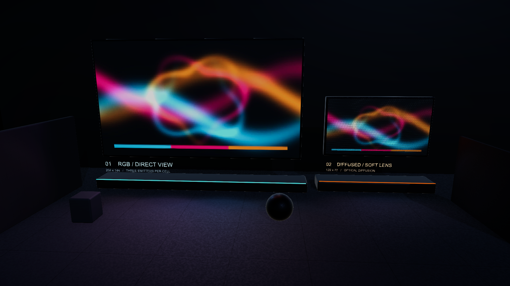
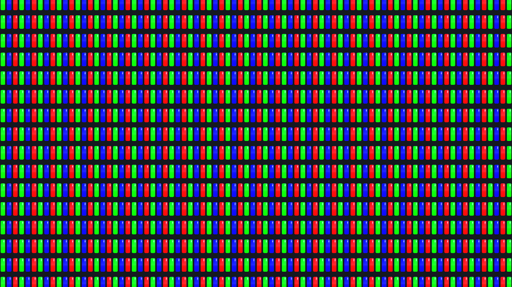
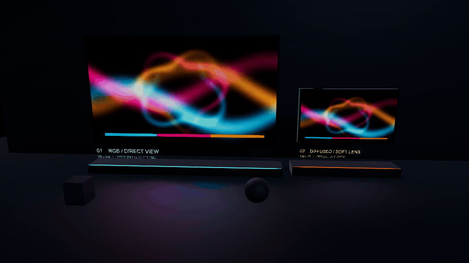
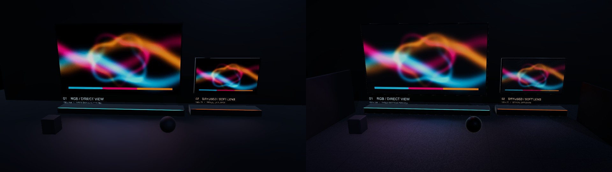

# UnityLEDSystem

Unity 6.0.79f1 / URP 17.0.4向けのLED表示と映像連動照明のプロジェクトです。
コアは `Packages/com.mizotake.led-wall`、動作するサンプルは `Assets/LEDGallery` にあります。



RGB LEDの拡大です。グレーの検証入力を使い、R/G/Bの素子、レンズの丸みとハイライト、黒い基板を確認できます。Unityの実描画を撮影しています。



固定カメラで約12秒間記録したGIFです。Compute Shaderで集計した映像の色をRenderer Featureが床へ加えます。床は標準URP Litで、LED用のLightは生成しません。



基板・レンズのPBR質感、面積平均による映像の色光、時間補間、床・布・金属の素材差を含む改善版です。Git URLの `#main` で現在の実装を導入できます。Package Managerが解決したGitコミットはpackages-lock.jsonに記録されます。

同じポスターと固定カメラで撮影した、初期版（左）とLight方式で質感を改善した時点（右）の比較です。上のGalleryとGIFは現在のColor Spill方式です。



## サンプルを見る

1. このリポジトリをcloneし、Unity Hubから開きます。
2. `Assets/LEDGallery/Scenes/LEDGallery.unity` を開いてPlayします。サンプル用URP設定は適用済みで、カメラは固定です。
3. `01 / RGB LED` または `02 / Diffused LED` のLedPanelをInspectorで選びます。`Transition` は0で動画A、1で静止画B、0.5で半々になります。Brightness、Tint、Resolution、Fill、Diffusion、Content Rectも再生中に調整できます。
4. `Shared Video Player` の標準VideoPlayerが動画を再生します。別の動画・URLへの差し替え、再生・停止・ループ・音声はVideoPlayer側で設定します。LedPanelのSourceとSecondary Sourceには別々のVideoPlayerも指定できます。

サンプルのControllerによるプロパティの上書きはありません。Play中の変更はUnity標準どおり終了時に戻るため、保存したい初期値はEditModeで変更してください。
床、球、キューブは通常の `Universal Render Pipeline/Lit` です。標準サンプルはRenderer Featureによる床の色加算を使用します。Spot Light方式も同じパネルのInspectorから選べます。

表示用シェーダーはRGB素子型と拡散レンズ型です。HDR発光、Bloom、ACES、Forward+、SSAOを使用しています。任意で使える平面反射床とGPUぼかしもコアにあります。

## Lightを使わずに床へ色を反映する

サンプルの `LEDGalleryRenderer` に `LedColorSpillRendererFeature` を追加済みです。Render Graphが有効なUnity 6 / URP 17で動作します。
LedPanelと同じGameObjectの `LedColorSpill` は2テクスチャのフェード、Tint、クロップをCompute Shaderで面積平均し、パネルの位置・面積・向きとBrightnessから床へ届く色を計算します。CPUへの色の読み戻しはありません。
`Receiver Mask` は受信するGameObjectのLayerです。サンプルでは床のWaterレイヤーだけを選択しています。`Strength` は色加算の強さ、`Emitter Grid` は面光源の分割数です。`Override Distribution` は標準OFFで、距離とソースの柔らかさはパネル寸法から決まります。`Screen Occlusion` は画面内の深度を使う簡易遮蔽の強さで、0で無効です。
設定はInspectorから変更できます。`Tools > LED Wall > Gallery Lighting > Color Spill` / `Generated Lights` は一度だけ方式を切り替えるメニューです。毎フレーム値を上書きするControllerはありません。手動で切り替える場合は、LedColorSpillとLedPanelLightingの片方だけを有効にして二重加算を避けます。
この方式は不透明な床の描画へ拡散色を加えます。床のMetallic・Smoothness・BaseMapを使ったPBR計算や画面外の遮蔽物の影は含みません。材質に応じた通常の受光や影が必要な場合はSpot Light方式を使います。

## ライトの自動設定

LedPanelと同じGameObjectの `LedPanelLighting` は映像、フェード、輝度、パネルのワールドサイズ・向きを参照します。
`Override Light Parameters` は標準でOFFです。輝度やTransformを変更すると生成ライトも追従します。光量・照射距離・角度を個別に調整したい場合だけONにしてください。
Culling Mask、Rendering Layers、影の設定は別に指定できます。生成ライトの数を変更しても再適用します。生成された子Lightの値は自動更新されるため、設定はLedPanelLightingのInspectorで行います。
Sampling Backendは標準Computeです。小さな集計バッファと色グリッドを使います。Blitは従来の縮小ピラミッドで、比較用にも選べます。Soft Distributionは標準でONです。Response Secondsは色変化のなめらかさ（標準0.08秒、0で即時）、Scene Cut Thresholdは色の急変で補間をリセットするしきい値です。Sampling Resolutionで集計精度を調整できます。Material側のLens Curvature、Lens Smoothness、Housing Smoothnessで表面の質感を調整します。
URPの受光対象の限定にはRendering Layersを使用してください。サンプルではURP AssetのRendering Layersを有効にしています。

## 集計処理の計測

RTX 4070 / D3D11のWindows Development Playerで、1280×720、元の動画、集計15 Hz、ウォームアップ3秒＋計測12秒を各方式3回実行した結果です。CPU欄はGPU命令発行区間の平均を各実行で求め、その中央値を示します。

| 方式 | 集計用の所有テクスチャ＋バッファ | 集計のCPU命令発行 | LED用Light |
| --- | ---: | ---: | ---: |
| Blit＋Light | 39.20 MB | 0.023 ms | 14 |
| Compute＋Light | 0.266 MB | 0.013 ms | 14 |
| Compute＋Color Spill | 0.232 MB | 0.013 ms | 0 |

Compute＋Lightでは集計用確保量が約99.3%、集計のCPU命令発行時間が約44%減りました。動画・カメラ・マテリアル・Render Graphの一時Depth/Normal/受信マスクは表のメモリに含みません。Color Spillは画面全体の色加算費用が加わります。非表示PlayerではGPUタイムスタンプを取得できなかったため、GPU時間・FPSの向上はこの結果から判断していません。
再現用の計測ビルドは `./Tools/Build-LightingBenchmark.ps1`、3方式の実行は `./Tools/Run-LightingBenchmark.ps1 -Runs 3` です。計測用コードはビルド時だけAssetsに置き、終了時に削除します。通常のサンプルに計測Controllerは含みません。

## UPM導入

Unity 6.0 / URP 17のプロジェクトで、Package Managerの「Install package from git URL…」へ次のURLを入力します。GitコマンドがPATHに必要です。

```text
https://github.com/MizoTake/UnityLEDSystem.git?path=/Packages/com.mizotake.led-wall#main
```

`Packages/manifest.json`へ追加する場合の依存エントリーです。

```json
"com.mizotake.led-wall": "https://github.com/MizoTake/UnityLEDSystem.git?path=/Packages/com.mizotake.led-wall#main"
```

Package Managerの `LED Wall for URP` > Samplesから `LED Gallery` をImportします。作成されたフォルダー内の `Scenes/LEDGallery.unity` を開いてPlayしてください。
別プロジェクトで必要な場合は `Tools > LED Wall > Use Gallery URP Settings` を選択します。このメニューはGraphics Settingsと現在のQualityのURP Assetを変更するので、使用中の設定を控えてから適用してください。
このリポジトリをプロジェクトとして開く場合はサンプルが既にあるため、重複Importは不要です。

ローカル導入では「Install package from disk…」でコアの `package.json` を指定できます。
`Tools/Export-Upm.ps1` はサンプルを `Samples~/LEDGallery` へ同期し、`Builds/UPM` にUPM用tgzを書き出します。「Install package from tarball…」での導入にも対応します。

## 権利と動画の生成元

`NeonOrbits.mp4` は12秒、1280×720、30 fps、音声なしの数学的なアニメーションです。`Prism.png` とポスターもこのプロジェクトで生成しています。サンプルメディアには外部の映像、音楽、画像、ブランド素材を使用していません。
生成コードは `Tools/generate_sample_video.py`、由来とハッシュは `Assets/LEDGallery/Media/PROVENANCE.json` に記録しています。
床・布・金属のサーフェスマップもオリジナルの数式からGPUで生成します。生成処理は `Assets/LEDGallery/Shaders/GallerySurface.shader` と `Editor/LedGalleryBuilder.cs`、由来は `Assets/LEDGallery/Surfaces/PROVENANCE.json` にあります。Gallery再構築メニューで再生成できます。
GPUのH.264 NVENC、Baseline、Bフレームなし、BT.709の色メタデータで出力しています。

```powershell
python Tools/generate_sample_video.py
python Tools/generate_sample_video.py --still-only
```

生成には既存環境のNumPyとFFmpegを使用します。NVENCがない生成環境では `--encoder libx264` を指定できます。
本プロジェクトの独自コード・ドキュメント・サンプルの生成素材は [MITライセンス](LICENSE) で提供します。UPMパッケージにも同じ [LICENSE.md](Packages/com.mizotake.led-wall/LICENSE.md) を同梱しています。

## 検証

開いたEditorにUnityCLIのPipelineサーバーが接続できる環境で実行します。

```powershell
unity status --json
./Tools/Verify-Unity.ps1
./Tools/Export-Upm.ps1
./Tools/Verify-Distribution.ps1
./Tools/Verify-Consumer.ps1
./Tools/Verify-Consumer.ps1 -PackageUrl 'https://github.com/MizoTake/UnityLEDSystem.git?path=/Packages/com.mizotake.led-wall#main'
```

READMEのGIFを撮り直す場合は、LEDGalleryをPlayし、VideoPlayerの準備完了後に `./Tools/Record-ReadmePreview.ps1` を実行します。UnityCLI経由で実描画を記録し、FFmpegでGIFへ変換します。撮影中だけカメラの構図を変更し、終了後に戻します。動画のフレームが進まない場合はエラーにして、静止したGIFの出力を防ぎます。
静止画は `./Tools/Capture-ReadmeStills.ps1` で撮影できます。Galleryは元のポスター、RGBの拡大はグレーの検証入力を使います。撮影後にカメラとLedPanelの設定を戻します。

テストは反射の数式、シェーダーコンパイル、RGB素子のGPU出力、A/Bフェード、GPU色集計、ComputeとBlitのHDR集計比較、Lightを使わないLit床の色加算とLayerMask・発光面の向き・距離制限、通常のURP Litの受光とRendering Layers、ライトの自動追従・個別調整・再生成、標準VideoPlayerの再生・一時停止・停止を対象にしています。
実行ログは `Logs/LEDWall` に保存します。Library、Temp、ビルド出力はGitへ含めません。
導入、API、性能、制約は [パッケージの使用手順](Packages/com.mizotake.led-wall/Documentation~/index.md)、実施済みの検証と未検証範囲は [VALIDATION.md](VALIDATION.md) を参照してください。
